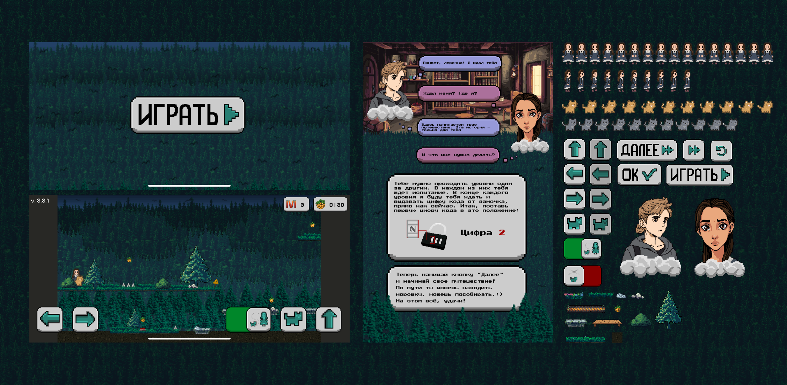
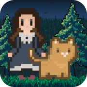

  

<h1 align="center">web_game_gift</h1>

  

  Небольшая веб-игра, созданная как цифровое дополнение к физическому подарку.  

---

<b>Русская версия</b>

## Описание

Лёгкая веб-игра с пиксельным интерфейсом и тёплой атмосферой.  
Игра полностью автономна — всё работает **локально** в браузере.

---

## ⚙️ Структура проекта

### Страницы

| Страница | Назначение |
|-----------|-------------|
| `play.html` | Стартовая страница с кнопкой **«Играть»** |
| `index.html` | Основная страница с игрой (логика и отрисовка на **Canvas**) |
| `dialog.html` | Страница с **диалогом / картинкой**, отображается после завершения уровня |
| `editor.html` | **Редактор уровней** с возможностью **экспорта и импорта JSON** структур |

---

### Технологии

| Категория | Используемые технологии |
|------------|-------------------------|
| Core | HTML5, CSS3, JavaScript |
| Graphics | Canvas API |
| Data | Local Storage |
| Editor | JSON Import / Export |
| Interaction | HTML-кнопки, JS-события |

---

### Логика

- Вся логика реализована на **чистом JavaScript**  
- Прогресс и настройки сохраняются в **Local Storage**  
- Межстраничная навигация:  
  `play → index → dialog → (опционально) editor`  
- Минимальное использование DOM — основная работа через **Canvas**  

---

### Особенности

- Проект задуман как **персональный подарок**
- Полностью автономен (не требует сервера)   
- Редактор позволяет **расширять игру** новыми уровнями  
- Код легко модифицировать для добавления сцен, диалогов или мини-игр  

---

<b>English Version</b>

## Project

A small **web game** created as a digital addition to a physical gift —  
simple, heartfelt, and fully browser-based ❤️  

Built with **pure JavaScript** and **Canvas**, using **Local Storage** to save progress.

---

## ⚙️ Project Structure

### Pages

| Page | Description |
|------|--------------|
| `play.html` | Start page with a **"Play"** button |
| `index.html` | Main game page rendered on **Canvas** |
| `dialog.html` | Dialog / image page shown after each game |
| `editor.html` | **Level editor** with **JSON import/export** support |

---

### Technologies

| Category | Used Technologies |
|-----------|------------------|
| Core | HTML5, CSS3, JavaScript |
| Graphics | Canvas API |
| Data | Local Storage |
| Editor | JSON Import / Export |
| Interaction | HTML Buttons, JS Events |

---

### Logic

- Entirely written in **pure JavaScript**  
- Game state and progress stored in **Local Storage**  
- Page flow:  
  `play → index → dialog → (optional) editor`  
- Minimal DOM usage — most interaction handled via **Canvas**  

---

### Highlights

- Designed as a **personal, sentimental gift**  
- Fully **offline** — no server required   
- Built-in **level editor** for creativity and replayability  
- Easy to extend with new levels or dialogues  

---

